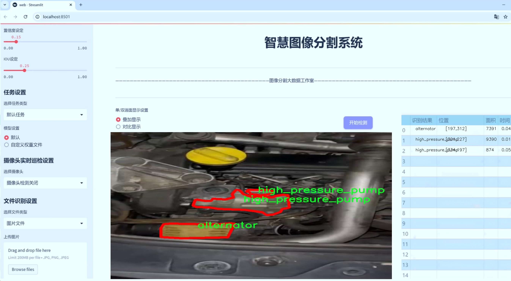
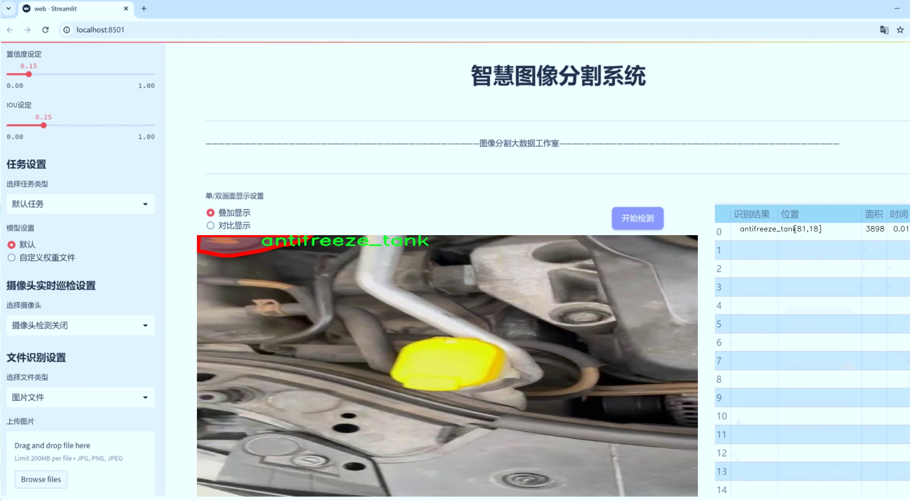
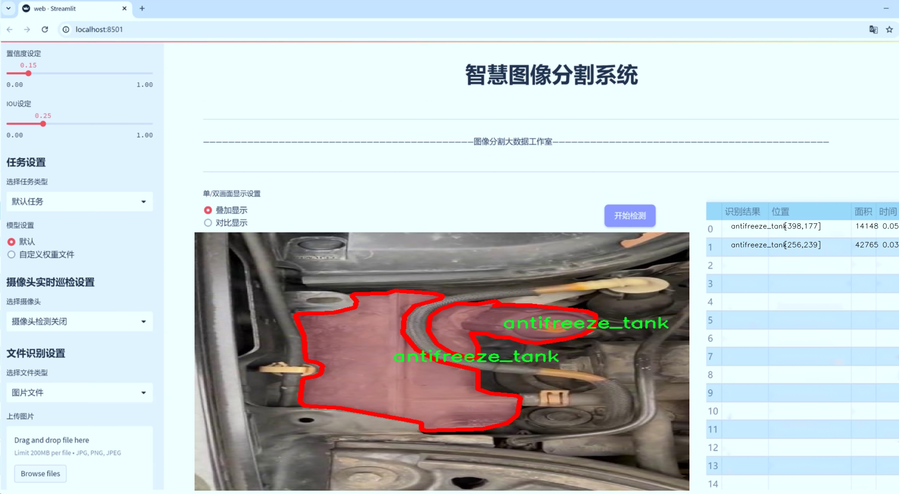
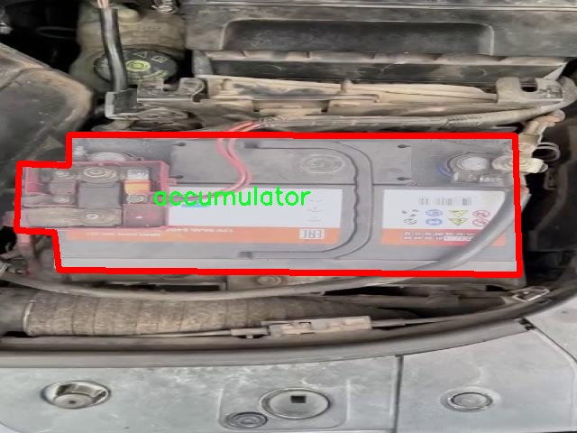
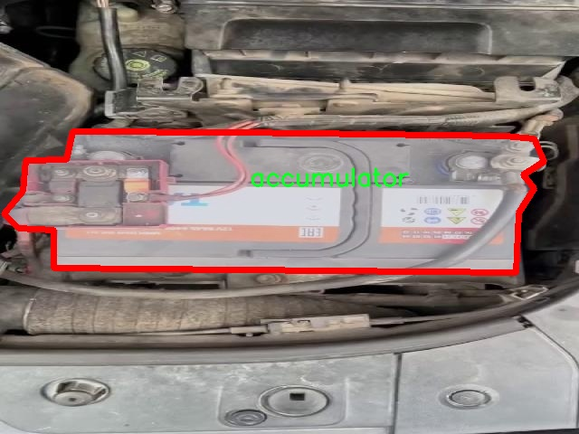
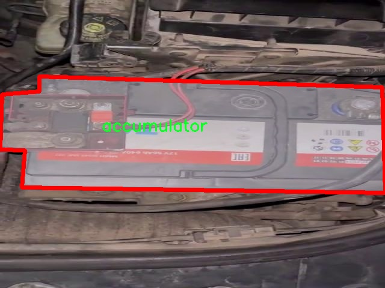
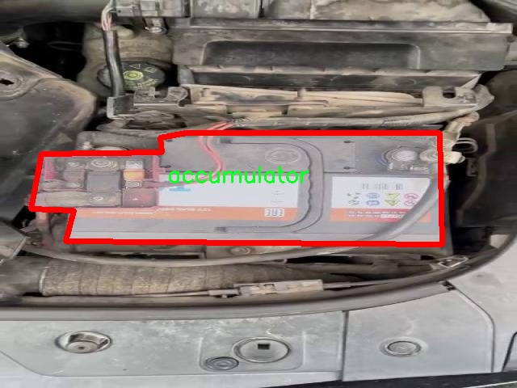

# 汽车发动机部件分割系统源码＆数据集分享
 [yolov8-seg-convnextv2＆yolov8-seg-dyhead-DCNV3等50+全套改进创新点发刊_一键训练教程_Web前端展示]

### 1.研究背景与意义

项目参考[ILSVRC ImageNet Large Scale Visual Recognition Challenge](https://gitee.com/YOLOv8_YOLOv11_Segmentation_Studio/projects)

项目来源[AAAI Global Al lnnovation Contest](https://kdocs.cn/l/cszuIiCKVNis)

研究背景与意义

随着汽车工业的快速发展，汽车发动机作为汽车的核心部件，其性能和可靠性直接影响到整车的运行效率和安全性。发动机内部结构复杂，包含多个关键部件，如蓄电池、发电机、防冻液箱、保险丝盒和高压泵等。这些部件的准确识别与分割对于发动机的故障诊断、维护保养以及智能制造等领域具有重要意义。因此，如何高效、准确地对汽车发动机部件进行分割与识别，成为了计算机视觉和深度学习领域的重要研究课题。

近年来，YOLO（You Only Look Once）系列模型因其高效的实时目标检测能力而受到广泛关注。YOLOv8作为该系列的最新版本，结合了多种先进的深度学习技术，显著提升了目标检测的精度和速度。然而，尽管YOLOv8在目标检测方面表现出色，但在复杂背景下的实例分割任务中仍然面临一定的挑战。特别是在汽车发动机部件的分割中，部件之间的相互遮挡、形状多样性以及光照变化等因素，都会影响模型的分割效果。因此，基于YOLOv8的改进实例分割系统的研究，具有重要的理论价值和实际应用意义。

本研究将利用一个包含1200张图像的数据集，针对五类汽车发动机部件进行实例分割。该数据集的多样性和丰富性为模型的训练提供了良好的基础。通过对蓄电池、发电机、防冻液箱、保险丝盒和高压泵等部件的精准标注，研究者能够深入分析不同部件在图像中的特征表现，从而为模型的改进提供数据支持。此外，利用Roboflow平台进行数据集的构建和增强，将进一步提升模型的泛化能力和鲁棒性。

在实际应用中，基于改进YOLOv8的汽车发动机部件分割系统，不仅可以提升汽车维修行业的工作效率，还能为智能制造和自动化检测提供技术支持。通过实现对发动机部件的自动识别与分割，相关企业可以减少人工干预，提高检测的准确性和效率，从而降低生产成本，提升产品质量。同时，该系统的应用也将推动汽车行业向智能化、数字化转型，为未来的智能汽车发展奠定基础。

综上所述，基于改进YOLOv8的汽车发动机部件分割系统的研究，不仅具有重要的学术价值，还在实际应用中展现出广阔的前景。通过深入探讨实例分割技术在汽车发动机领域的应用，研究者能够为推动汽车行业的智能化发展贡献力量，同时为相关领域的研究提供新的思路和方法。

### 2.图片演示







##### 注意：由于此博客编辑较早，上面“2.图片演示”和“3.视频演示”展示的系统图片或者视频可能为老版本，新版本在老版本的基础上升级如下：（实际效果以升级的新版本为准）

  （1）适配了YOLOV8的“目标检测”模型和“实例分割”模型，通过加载相应的权重（.pt）文件即可自适应加载模型。

  （2）支持“图片识别”、“视频识别”、“摄像头实时识别”三种识别模式。

  （3）支持“图片识别”、“视频识别”、“摄像头实时识别”三种识别结果保存导出，解决手动导出（容易卡顿出现爆内存）存在的问题，识别完自动保存结果并导出到tempDir中。

  （4）支持Web前端系统中的标题、背景图等自定义修改，后面提供修改教程。

  另外本项目提供训练的数据集和训练教程,暂不提供权重文件（best.pt）,需要您按照教程进行训练后实现图片演示和Web前端界面演示的效果。

### 3.视频演示

[3.1 视频演示](https://www.bilibili.com/video/BV14D2VYuEPJ/)

### 4.数据集信息展示

##### 4.1 本项目数据集详细数据（类别数＆类别名）

nc: 5
names: ['accumulator', 'alternator', 'antifreeze_tank', 'fuse_box', 'high_pressure_pump']


##### 4.2 本项目数据集信息介绍

数据集信息展示

在现代汽车工程中，发动机部件的精确分割与识别对于提升维修效率和保障车辆性能至关重要。为此，我们构建了一个专门用于训练改进YOLOv8-seg的汽车发动机部件分割系统的数据集，命名为“yolov8-seg-custom”。该数据集的设计旨在提供高质量的标注数据，以支持深度学习模型在复杂环境中对汽车发动机部件的精准识别与分割。

“yolov8-seg-custom”数据集包含五个主要类别，分别是：蓄电池（accumulator）、发电机（alternator）、防冻液箱（antifreeze_tank）、保险丝盒（fuse_box）和高压泵（high_pressure_pump）。这些类别涵盖了汽车发动机中关键的部件，能够有效地反映出发动机的工作状态和性能。每个类别都经过精心挑选，确保其在实际应用中的重要性和普遍性。

在数据集的构建过程中，我们注重数据的多样性和代表性。数据来源于多种车型和不同的拍摄角度，确保模型能够学习到各种环境下的部件特征。每个类别的图像均经过严格的标注，确保每个部件的边界清晰可辨。这种高质量的标注不仅提高了模型的训练效果，也为后续的推理阶段提供了可靠的基础。

为了增强模型的鲁棒性，我们还对数据集进行了多种数据增强处理，包括旋转、缩放、裁剪和颜色调整等。这些处理使得模型在面对不同光照条件、视角变化和背景杂乱的情况下，依然能够保持较高的识别精度。此外，数据集还包含了一些噪声图像和部分遮挡的样本，以模拟真实世界中可能遇到的各种情况，从而提升模型的适应能力。

在数据集的使用过程中，我们将其分为训练集、验证集和测试集，以便于模型的训练和评估。训练集用于模型的学习，验证集用于调优超参数，而测试集则用于最终的性能评估。通过这种划分，我们能够确保模型在未见数据上的泛化能力，从而提高其在实际应用中的可靠性。

总之，“yolov8-seg-custom”数据集为改进YOLOv8-seg的汽车发动机部件分割系统提供了坚实的基础。通过精心设计的类别和高质量的标注数据，该数据集不仅能够有效提升模型的分割精度，还能在多种复杂环境中保持良好的性能。随着深度学习技术的不断发展，我们相信该数据集将在汽车工程领域的智能化和自动化进程中发挥重要作用，为推动汽车维修和保养的智能化提供强有力的支持。










### 5.全套项目环境部署视频教程（零基础手把手教学）

[5.1 环境部署教程链接（零基础手把手教学）](https://www.bilibili.com/video/BV1jG4Ve4E9t/?vd_source=bc9aec86d164b67a7004b996143742dc)


[5.2 安装Python虚拟环境创建和依赖库安装视频教程链接（零基础手把手教学）](https://www.bilibili.com/video/BV1nA4VeYEze/?vd_source=bc9aec86d164b67a7004b996143742dc)

### 6.手把手YOLOV8-seg训练视频教程（零基础小白有手就能学会）

[6.1 手把手YOLOV8-seg训练视频教程（零基础小白有手就能学会）](https://www.bilibili.com/video/BV1cA4VeYETe/?vd_source=bc9aec86d164b67a7004b996143742dc)


按照上面的训练视频教程链接加载项目提供的数据集，运行train.py即可开始训练



     Epoch   gpu_mem       box       obj       cls    labels  img_size
     1/200     0G   0.01576   0.01955  0.007536        22      1280: 100%|██████████| 849/849 [14:42<00:00,  1.04s/it]
               Class     Images     Labels          P          R     mAP@.5 mAP@.5:.95: 100%|██████████| 213/213 [01:14<00:00,  2.87it/s]
                 all       3395      17314      0.994      0.957      0.0957      0.0843

     Epoch   gpu_mem       box       obj       cls    labels  img_size
     2/200     0G   0.01578   0.01923  0.007006        22      1280: 100%|██████████| 849/849 [14:44<00:00,  1.04s/it]
               Class     Images     Labels          P          R     mAP@.5 mAP@.5:.95: 100%|██████████| 213/213 [01:12<00:00,  2.95it/s]
                 all       3395      17314      0.996      0.956      0.0957      0.0845

     Epoch   gpu_mem       box       obj       cls    labels  img_size
     3/200     0G   0.01561    0.0191  0.006895        27      1280: 100%|██████████| 849/849 [10:56<00:00,  1.29it/s]
               Class     Images     Labels          P          R     mAP@.5 mAP@.5:.95: 100%|███████   | 187/213 [00:52<00:00,  4.04it/s]
                 all       3395      17314      0.996      0.957      0.0957      0.0845


### 7.50+种全套YOLOV8-seg创新点代码加载调参视频教程（一键加载写好的改进模型的配置文件）

[7.1 50+种全套YOLOV8-seg创新点代码加载调参视频教程（一键加载写好的改进模型的配置文件）](https://www.bilibili.com/video/BV1Hw4VePEXv/?vd_source=bc9aec86d164b67a7004b996143742dc)

### 8.YOLOV8-seg图像分割算法原理

原始YOLOV8-seg算法原理

YOLOv8-seg是YOLO系列中最新的图像分割算法，继承了YOLOv8的高效特性，并在此基础上进一步增强了对图像中物体的分割能力。该算法的设计旨在应对复杂场景下的目标检测与分割任务，尤其是在背景复杂、目标特征多样的情况下，提升模型的准确性和鲁棒性。YOLOv8-seg通过引入先进的网络结构和创新的损失函数，旨在实现更高的分割精度和更快的推理速度。

首先，YOLOv8-seg的网络结构分为四个主要模块：输入端、主干网络、颈部网络和输出端。输入端负责对输入图像进行预处理，包括马赛克数据增强、自适应图像缩放和灰度填充等操作。这些预处理步骤不仅可以提高模型的泛化能力，还能有效减少训练过程中的过拟合现象。通过多样化的输入，YOLOv8-seg能够更好地适应不同场景的需求。

在主干网络部分，YOLOv8-seg采用了C2f模块，这一模块通过丰富的跨层连接，增强了特征的梯度流动性，使得模型在特征提取过程中能够捕捉到更为细致的上下文信息。CSP（Cross Stage Partial）结构的引入，使得特征提取过程被有效地分为两部分，分别进行卷积和连接，从而提升了特征表示的能力。末尾的SPPF（Spatial Pyramid Pooling Fusion）模块则通过多尺度特征融合，进一步提高了模型的计算速度和分割精度。

颈部网络采用了PAN-FPN（Path Aggregation Network - Feature Pyramid Network）结构，旨在通过上采样和下采样的方式，对不同尺度的特征图进行有效融合。这一设计使得YOLOv8-seg能够在处理小目标时，保持较高的检测精度。PAN结构的优势在于其能够有效地捕捉到多尺度信息，从而在复杂环境中提升目标的分割能力。

输出端则采用了解耦头结构，分类和回归过程被有效分离，减少了两者之间的干扰。YOLOv8-seg的检测网络采用了Anchor-Free的检测方式，这一创新不仅减少了锚框的预测数量，还加速了非最大抑制（NMS）过程，显著提高了模型的推理速度。通过Task-Aligned Assigner方法，YOLOv8-seg能够根据分类和回归的加权结果，智能地匹配正样本，确保了训练过程的高效性。

在损失函数的设计上，YOLOv8-seg引入了CloU（Complete Intersection over Union）损失函数，旨在提升模型的边界框预测精度。与传统的损失函数相比，CloU损失能够更好地反映预测框与真实框之间的重叠程度，从而提高模型在复杂场景下的定位能力。此外，YOLOv8-seg还针对小目标的漏检问题，设计了更小的检测头，以增强网络对小目标的感知能力。

YOLOv8-seg的创新之处不仅体现在网络结构的优化上，还包括对小目标检测的专门设计。通过引入BiFormer双层路由注意力机制，YOLOv8-seg能够有效捕获远程依赖关系，进一步提升特征提取的细粒度上下文信息。这一机制在复杂水面环境下尤其重要，因为小目标漂浮物的特征往往复杂多变，背景也相对杂乱。通过引入这一机制，YOLOv8-seg能够更好地应对这些挑战，提升对小目标的检测和分割能力。

总的来说，YOLOv8-seg在YOLOv8的基础上，通过多项创新设计，显著提升了图像分割的精度和速度。其主干网络的改进、颈部网络的特征融合策略以及解耦头结构的应用，使得YOLOv8-seg在复杂场景下表现出色。随着计算机视觉技术的不断发展，YOLOv8-seg无疑将在实际应用中展现出更大的潜力，成为目标检测与分割领域的重要工具。


### 9.系统功能展示（检测对象为举例，实际内容以本项目数据集为准）

图9.1.系统支持检测结果表格显示

  图9.2.系统支持置信度和IOU阈值手动调节

  图9.3.系统支持自定义加载权重文件best.pt(需要你通过步骤5中训练获得)

  图9.4.系统支持摄像头实时识别

  图9.5.系统支持图片识别

  图9.6.系统支持视频识别

  图9.7.系统支持识别结果文件自动保存

  图9.8.系统支持Excel导出检测结果数据


### 10.50+种全套YOLOV8-seg创新点原理讲解（非科班也可以轻松写刊发刊，V11版本正在科研待更新）

#### 10.1 由于篇幅限制，每个创新点的具体原理讲解就不一一展开，具体见下列网址中的创新点对应子项目的技术原理博客网址【Blog】：


[10.1 50+种全套YOLOV8-seg创新点原理讲解链接](https://gitee.com/qunmasj/good)

#### 10.2 部分改进模块原理讲解(完整的改进原理见上图和技术博客链接)【如果此小节的图加载失败可以通过CSDN或者Github搜索该博客的标题访问原始博客，原始博客图片显示正常】
### 可变性卷积DCN简介
卷积神经网络由于其构建模块中固定的几何结构，本质上受限于模型几何变换。为了提高卷积神经网络的转换建模能力，《Deformable Convolutional Networks》作者提出了两个模块：可变形卷积（deformable convolution）和可变形RoI池（deformable RoI pooling）。这两个模块均基于用额外的偏移来增加模块中的空间采样位置以及从目标任务中学习偏移的思想，而不需要额外的监督。

第一次证明了在深度神经网络中学习密集空间变换（dense spatial transformation）对于复杂的视觉任务是有效的

视觉识别中的一个关键挑战是如何适应对象比例、姿态、视点和零件变形中的几何变化或模型几何变换。一般有两种方法实现：
1）建立具有足够期望变化的训练数据集。这通常通过增加现有的数据样本来实现，例如通过仿射变换。但是训练成本昂贵而且模型参数庞大。
2）使用变换不变（transformation-invariant）的特征和算法。比如比较有名的SIFT(尺度不变特征变换)便是这一类的代表算法。

但以上的方法有两个缺点：
1）几何变换被假定为固定的和已知的，这些先验知识被用来扩充数据，设计特征和算法。为此，这个假设阻止了对具有未知几何变换的新任务的推广，从而导致这些几何变换可能没有被正确建模。
2）对于不变特征和算法进行手动设计，对于过于复杂的变换可能是困难的或不可行的。

卷积神经网络本质上局限于模拟大型未知转换。局限性源于CNN模块的固定几何结构：卷积单元在固定位置对输入特征图进行采样；池化层以固定比率降低特征矩阵分辨率；RoI（感兴趣区域）池化层将RoI分成固定的空间箱（spatial bins）等。缺乏处理几何变换的内部机制。

这种内部机制的缺乏会导致一些问题，举个例子。同一个CNN层中所有激活单元的感受野大小是相同的，但是这是不可取的。因为不同的位置可能对应于具有不同尺度或变形的对象，所以尺度或感受野大小的自适应确定对于具有精细定位的视觉识别是渴望的。

对于这些问题，作者提出了两个模块提高CNNs对几何变换建模的能力。


deformable convolution（可变形卷积）
将2D偏移量添加到标准卷积中的常规网格采样位置，使得采样网格能够自由变形。通过额外的卷积层，从前面的特征映射中学习偏移。因此，变形采用局部、密集和自适应的方式取决于输入特征。


deformable RoI pooling（可变形RoI池化）
为先前RoI池化的常规库（bin）分区中的每个库位置（bin partition）增加了一个偏移量。类似地，偏移是从前面的特征图和感兴趣区域中学习的，从而能够对具有不同形状的对象进行自适应部件定位（adaptive part localization）。

#### Deformable Convolutional Networks
Deformable Convolution
2D卷积由两个步骤组成：
1）在输入特征图x xx上使用规则网格R RR进行采样。
2）把这些采样点乘不同权重w ww后相加。

网格R定义感受野大小和扩张程度，比如内核大小为3x3，扩张程度为1的网格R可以表示为：
R = { ( − 1 , − 1 ) , ( − 1 , 0 ) , … , ( 0 , 1 ) , ( 1 , 1 ) } R = \{(-1,-1),(-1,0),\dots,(0,1),(1,1)\}
R={(−1,−1),(−1,0),…,(0,1),(1,1)}

​
 一般为小数，使用双线性插值进行处理。（把小数坐标分解到相邻的四个整数坐标点来计算结果）


具体操作如图所示：


首先对输入特征层进行一个普通的3x3卷积处理得到偏移域（offset field）。偏移域特征图具有与输入特征图相同的空间分辨率，channels维度2N对应于N个2D（xy两个方向）偏移。其中的N是原输入特征图上所具有的N个channels，也就是输入输出channels保持不变，这里xy两个channels分别对输出特征图上的一个channels进行偏移。确定采样点后就通过与相对应的权重w点乘相加得到输出特征图上该点最终值。

前面也提到过，由于这里xy两个方向所训练出来的偏移量一般来说是一个小数，那么为了得到这个点所对应的数值，会采用双线性插值的方法，从最近的四个邻近坐标点中计算得到该偏移点的数值，公式如下：


具体推理过程见：双线性插值原理

#### Deformable RoI Poolingb
所有基于区域提议（RPN）的对象检测方法都使用RoI池话处理，将任意大小的输入矩形区域转换为固定大小的特征图。


 一般为小数，需要使用双线性插值进行处理。


具体操作如图所示：


当时看这个部分的时候觉得有些突兀，明明RoI池化会将特征层转化为固定尺寸的区域。其实，我个人觉得，这个部分与上述的可变性卷积操作是类似的。这里同样是使用了一个普通的RoI池化操作，进行一些列处理后得到了一个偏移域特征图，然后重新作用于原来的w × H w \times Hw×H的RoI。只不过这里不再是规律的逐行逐列对每个格子进行池化，而是对于格子进行偏移后再池化处理。

#### Postion﹣Sensitive RoI Pooling
除此之外，论文还提出一种PS RoI池化（Postion﹣Sensitive RoI Pooling）。不同于上述可变形RoI池化中的全连接过程，这里使用全卷积替换。

具体操作如图所示：


首先，对于原来的特征图来说，原本是将输入特征图上的RoI区域分成k × k k\times kk×k个bin。而在这里，则是将输入特征图进行卷积操作，分别得到一个channels为k 2 ( C + 1 ) k^{2}(C+1)k (C+1)的得分图（score maps）和一个channels为2 k 2 ( C + 1 ) 2k{2}(C+1)2k 2 (C+1)的偏移域（offset fields），这两个特征矩阵的宽高是与输入特征矩阵相同的。其中，得分图的channels中，k × k k \times kk×k分别表示的是每一个网格，C CC表示的检测对象的类别数目，1表示背景。而在偏移域中的2表示xy两个方向的偏移。
也就是说，在PS RoI池化中，对于RoI的每一个网格都独自占一个通道形成一层得分图，然后其对于的偏移量占两个通道。offset fields得到的偏移是归一化后的偏移，需要通过和deformable RoI pooling中一样的变换方式得到∆ p i j ∆p_{ij}∆p ij，然后对每层得分图进行偏移池化处理。最后处理完的结果就对应着最后输出的一个网格。所以其包含了位置信息。

原文论述为：


#### Understanding Deformable ConvNets
当可变形卷积叠加时，复合变形的效果是深远的。如图所示：


ps：a是标准卷积的固定感受野，b是可变形卷积的适应性感受野。

感受野和标准卷积中的采样位置在整个顶部特征图上是固定的(左)。在可变形卷积中，它们根据对象的比例和形状进行自适应调整(右)。


### 11.项目核心源码讲解（再也不用担心看不懂代码逻辑）

#### 11.1 ui.py

以下是经过简化和注释的核心代码部分：

```python
import sys
import subprocess
from QtFusion.path import abs_path

def run_script(script_path):
    """
    使用当前 Python 环境运行指定的脚本。

    Args:
        script_path (str): 要运行的脚本路径
    """
    # 获取当前 Python 解释器的路径
    python_path = sys.executable

    # 构建运行命令，使用 streamlit 运行指定的脚本
    command = f'"{python_path}" -m streamlit run "{script_path}"'

    # 执行命令并等待其完成
    result = subprocess.run(command, shell=True)
    
    # 检查命令执行的返回码，若不为0则表示出错
    if result.returncode != 0:
        print("脚本运行出错。")

# 主程序入口
if __name__ == "__main__":
    # 获取要运行的脚本的绝对路径
    script_path = abs_path("web.py")

    # 调用函数运行脚本
    run_script(script_path)
```

### 代码注释说明：
1. **导入模块**：
   - `sys`：用于获取当前 Python 解释器的路径。
   - `subprocess`：用于执行外部命令。
   - `abs_path`：从 `QtFusion.path` 模块导入，用于获取文件的绝对路径。

2. **`run_script` 函数**：
   - 接收一个脚本路径作为参数，并使用当前 Python 环境运行该脚本。
   - 通过 `sys.executable` 获取当前 Python 解释器的路径。
   - 构建一个命令字符串，使用 `streamlit` 模块运行指定的脚本。
   - 使用 `subprocess.run` 执行命令，并等待其完成。
   - 检查返回码，如果不为0，打印错误信息。

3. **主程序入口**：
   - 在 `__main__` 模块中，获取要运行的脚本的绝对路径（`web.py`）。
   - 调用 `run_script` 函数来执行该脚本。

这个文件是一个名为 `ui.py` 的 Python 脚本，主要功能是通过当前的 Python 环境来运行一个指定的脚本。首先，文件导入了必要的模块，包括 `sys`、`os` 和 `subprocess`，以及一个自定义的模块 `QtFusion.path` 中的 `abs_path` 函数。

在脚本的核心部分，定义了一个名为 `run_script` 的函数，该函数接受一个参数 `script_path`，表示要运行的脚本的路径。函数内部首先获取当前 Python 解释器的路径，这通过 `sys.executable` 实现。接着，构建一个命令字符串，使用 `streamlit` 模块来运行指定的脚本。命令的格式是将 Python 解释器的路径和要运行的脚本路径组合在一起。

然后，使用 `subprocess.run` 方法来执行这个命令。该方法的 `shell=True` 参数表示在一个新的 shell 中执行命令。执行完命令后，检查返回的结果，如果返回码不为 0，表示脚本运行过程中出现了错误，此时会打印出一条错误信息。

在文件的最后部分，使用 `if __name__ == "__main__":` 语句来确保只有在直接运行该脚本时才会执行后面的代码。在这里，首先调用 `abs_path` 函数来获取 `web.py` 脚本的绝对路径，然后调用 `run_script` 函数来运行这个脚本。

总体来看，这个脚本的功能是提供一个简单的接口，通过当前的 Python 环境来运行一个名为 `web.py` 的 Streamlit 应用，方便用户在命令行中启动这个应用。

#### 11.2 ultralytics\utils\ops.py

以下是经过简化并注释的核心代码部分，主要包括一些重要的函数和类：

```python
import numpy as np
import torch
import torchvision

def segment2box(segment, width=640, height=640):
    """
    将一个分割标签转换为一个边界框标签，应用图像内部约束，即将(xy1, xy2, ...)转换为(xyxy)。

    参数:
        segment (torch.Tensor): 分割标签
        width (int): 图像宽度，默认为640
        height (int): 图像高度，默认为640

    返回:
        (np.ndarray): 分割的最小和最大x、y值。
    """
    x, y = segment.T  # 提取分割的x和y坐标
    inside = (x >= 0) & (y >= 0) & (x <= width) & (y <= height)  # 确保坐标在图像内部
    x, y = x[inside], y[inside]  # 仅保留在图像内部的坐标
    return np.array([x.min(), y.min(), x.max(), y.max()], dtype=segment.dtype) if any(x) else np.zeros(4, dtype=segment.dtype)  # 返回边界框坐标

def scale_boxes(img1_shape, boxes, img0_shape, ratio_pad=None, padding=True):
    """
    将边界框从原始图像的形状缩放到目标图像的形状。

    参数:
        img1_shape (tuple): 原始图像的形状，格式为(height, width)。
        boxes (torch.Tensor): 图像中物体的边界框，格式为(x1, y1, x2, y2)
        img0_shape (tuple): 目标图像的形状，格式为(height, width)。
        ratio_pad (tuple): 缩放边界框的比率和填充信息。
        padding (bool): 如果为True，假设边界框基于YOLO风格的图像增强。

    返回:
        boxes (torch.Tensor): 缩放后的边界框，格式为(x1, y1, x2, y2)
    """
    if ratio_pad is None:  # 如果没有提供比率和填充，计算它们
        gain = min(img1_shape[0] / img0_shape[0], img1_shape[1] / img0_shape[1])  # 计算缩放比
        pad = (img1_shape[1] - img0_shape[1] * gain) / 2, (img1_shape[0] - img0_shape[0] * gain) / 2  # 计算填充
    else:
        gain = ratio_pad[0][0]
        pad = ratio_pad[1]

    if padding:
        boxes[..., [0, 2]] -= pad[0]  # 应用x方向的填充
        boxes[..., [1, 3]] -= pad[1]  # 应用y方向的填充
    boxes[..., :4] /= gain  # 缩放边界框
    clip_boxes(boxes, img0_shape)  # 确保边界框在目标图像内部
    return boxes

def non_max_suppression(prediction, conf_thres=0.25, iou_thres=0.45, classes=None, max_det=300):
    """
    对一组边界框执行非最大抑制(NMS)。

    参数:
        prediction (torch.Tensor): 预测的边界框、类别和掩码的张量。
        conf_thres (float): 置信度阈值，低于该值的边界框将被过滤。
        iou_thres (float): IoU阈值，低于该值的边界框将被过滤。
        classes (List[int]): 要考虑的类别索引列表。
        max_det (int): NMS后要保留的最大边界框数量。

    返回:
        (List[torch.Tensor]): 每个图像的保留边界框的列表。
    """
    # 检查置信度和IoU阈值的有效性
    assert 0 <= conf_thres <= 1, f'Invalid Confidence threshold {conf_thres}'
    assert 0 <= iou_thres <= 1, f'Invalid IoU {iou_thres}'

    device = prediction.device
    bs = prediction.shape[0]  # 批量大小
    nc = prediction.shape[1] - 4  # 类别数量
    xc = prediction[:, 4:5].amax(1) > conf_thres  # 置信度候选框

    output = [torch.zeros((0, 6), device=prediction.device)] * bs  # 初始化输出
    for xi, x in enumerate(prediction):  # 遍历每个图像的预测
        x = x[xc[xi]]  # 仅保留置信度高的边界框
        if not x.shape[0]:  # 如果没有边界框，继续下一个图像
            continue

        # Detections matrix nx6 (xyxy, conf, cls)
        box, conf, cls = x.split((4, 1, nc), 1)  # 拆分边界框、置信度和类别
        conf, j = conf.max(1, keepdim=True)  # 选择置信度最高的类别
        x = torch.cat((box, conf, j.float()), 1)[conf.view(-1) > conf_thres]  # 过滤低置信度的边界框

        # 执行NMS
        boxes, scores = x[:, :4], x[:, 4]  # 提取边界框和置信度
        i = torchvision.ops.nms(boxes, scores, iou_thres)  # 应用NMS
        output[xi] = x[i][:max_det]  # 限制检测数量

    return output
```

### 代码说明
1. **segment2box**: 将分割区域转换为边界框，确保坐标在图像内部。
2. **scale_boxes**: 根据原始图像和目标图像的形状缩放边界框，确保边界框适应目标图像。
3. **non_max_suppression**: 对预测的边界框执行非最大抑制，过滤掉重叠的边界框，保留置信度高的边界框。

这些函数是YOLO模型中处理边界框和分割的重要部分，能够有效地进行目标检测和分割。

这个程序文件 `ultralytics/utils/ops.py` 是用于处理与 YOLO（You Only Look Once）目标检测模型相关的各种操作的工具类。文件中包含了多个函数和一个用于性能分析的上下文管理器 `Profile` 类。

`Profile` 类可以用作装饰器或上下文管理器，用于测量代码块的执行时间。它会在进入上下文时记录开始时间，退出时计算并返回经过的时间，方便开发者评估代码性能。

接下来的函数主要用于处理图像中的目标检测相关操作，包括将分割标签转换为边界框、缩放边界框、进行非极大值抑制（NMS）、坐标转换等。具体来说：

- `segment2box` 函数将分割标签转换为边界框，确保边界框在图像内部。
- `scale_boxes` 函数用于根据图像的不同尺寸调整边界框的大小，确保边界框适应新的图像尺寸。
- `make_divisible` 函数返回最接近的可被指定除数整除的数字，常用于调整网络层的通道数。
- `non_max_suppression` 函数实现非极大值抑制，过滤掉重叠的边界框，保留最有可能的检测结果。
- `clip_boxes` 和 `clip_coords` 函数用于将边界框和坐标限制在图像边界内，防止出现超出图像范围的情况。
- `scale_image` 函数将掩码调整为原始图像的大小。
- `xyxy2xywh` 和 `xywh2xyxy` 函数用于在不同的边界框表示格式之间进行转换。
- `masks2segments` 函数将掩码转换为分割段，允许根据不同策略选择分割段。
- `convert_torch2numpy_batch` 函数将 PyTorch 张量批量转换为 NumPy 数组，便于后续处理和可视化。
- `clean_str` 函数用于清理字符串，替换特殊字符为下划线，确保字符串的有效性。

这些工具函数为 YOLO 模型的实现提供了必要的支持，使得在图像中进行目标检测、处理和后处理变得更加高效和方便。整体上，这个文件是 YOLO 系列模型的重要组成部分，帮助开发者在实际应用中更好地利用模型进行目标检测任务。

#### 11.3 ultralytics\models\rtdetr\val.py

以下是代码中最核心的部分，并附上详细的中文注释：

```python
import torch
from ultralytics.data import YOLODataset
from ultralytics.models.yolo.detect import DetectionValidator
from ultralytics.utils import ops

class RTDETRDataset(YOLODataset):
    """
    RT-DETR数据集类，继承自YOLODataset类。
    该类专为RT-DETR目标检测模型设计，优化了实时检测和跟踪任务。
    """

    def __init__(self, *args, data=None, **kwargs):
        """初始化RTDETRDataset类，调用父类构造函数。"""
        super().__init__(*args, data=data, use_segments=False, use_keypoints=False, **kwargs)

    def load_image(self, i, rect_mode=False):
        """加载数据集中索引为'i'的图像，返回图像及其调整后的尺寸。"""
        return super().load_image(i=i, rect_mode=rect_mode)

    def build_transforms(self, hyp=None):
        """构建图像变换操作，主要用于评估阶段。"""
        if self.augment:
            # 根据增强参数设置mosaic和mixup的值
            hyp.mosaic = hyp.mosaic if self.augment and not self.rect else 0.0
            hyp.mixup = hyp.mixup if self.augment and not self.rect else 0.0
            transforms = v8_transforms(self, self.imgsz, hyp, stretch=True)  # 应用v8变换
        else:
            transforms = Compose([])  # 无变换
        transforms.append(
            Format(bbox_format='xywh',  # 设置边界框格式为xywh
                   normalize=True,  # 归一化
                   return_mask=self.use_segments,  # 是否返回分割掩码
                   return_keypoint=self.use_keypoints,  # 是否返回关键点
                   batch_idx=True,  # 返回批次索引
                   mask_ratio=hyp.mask_ratio,  # 掩码比例
                   mask_overlap=hyp.overlap_mask))  # 掩码重叠
        return transforms


class RTDETRValidator(DetectionValidator):
    """
    RTDETRValidator类，扩展了DetectionValidator类，提供专门针对RT-DETR模型的验证功能。
    该类允许构建RTDETR特定的数据集进行验证，应用非极大值抑制进行后处理，并相应更新评估指标。
    """

    def build_dataset(self, img_path, mode='val', batch=None):
        """
        构建RTDETR数据集。

        参数:
            img_path (str): 包含图像的文件夹路径。
            mode (str): 模式，'train'或'val'，用户可以为每种模式自定义不同的增强。
            batch (int, optional): 批次大小，默认为None。
        """
        return RTDETRDataset(
            img_path=img_path,
            imgsz=self.args.imgsz,
            batch_size=batch,
            augment=False,  # 不进行增强
            hyp=self.args,
            rect=False,  # 不进行矩形调整
            cache=self.args.cache or None,
            prefix=colorstr(f'{mode}: '),
            data=self.data)

    def postprocess(self, preds):
        """对预测输出应用非极大值抑制。"""
        bs, _, nd = preds[0].shape  # bs: 批次大小, nd: 预测维度
        bboxes, scores = preds[0].split((4, nd - 4), dim=-1)  # 分离边界框和分数
        bboxes *= self.args.imgsz  # 将边界框缩放到原始图像大小
        outputs = [torch.zeros((0, 6), device=bboxes.device)] * bs  # 初始化输出
        for i, bbox in enumerate(bboxes):  # 遍历每个边界框
            bbox = ops.xywh2xyxy(bbox)  # 转换边界框格式
            score, cls = scores[i].max(-1)  # 获取最大分数和对应类别
            pred = torch.cat([bbox, score[..., None], cls[..., None]], dim=-1)  # 合并边界框、分数和类别
            pred = pred[score.argsort(descending=True)]  # 按分数排序
            outputs[i] = pred  # 保存预测结果

        return outputs

    def update_metrics(self, preds, batch):
        """更新评估指标。"""
        for si, pred in enumerate(preds):
            idx = batch['batch_idx'] == si  # 获取当前批次的索引
            cls = batch['cls'][idx]  # 获取当前批次的类别
            bbox = batch['bboxes'][idx]  # 获取当前批次的边界框
            nl, npr = cls.shape[0], pred.shape[0]  # nl: 标签数量, npr: 预测数量
            shape = batch['ori_shape'][si]  # 获取原始图像的形状
            correct_bboxes = torch.zeros(npr, self.niou, dtype=torch.bool, device=self.device)  # 初始化正确边界框
            self.seen += 1  # 增加已处理的批次数

            if npr == 0:  # 如果没有预测
                if nl:
                    self.stats.append((correct_bboxes, *torch.zeros((2, 0), device=self.device), cls.squeeze(-1)))
                continue

            # 处理预测
            if self.args.single_cls:
                pred[:, 5] = 0  # 单类处理
            predn = pred.clone()  # 克隆预测
            predn[..., [0, 2]] *= shape[1] / self.args.imgsz  # 将预测边界框转换为原始空间
            predn[..., [1, 3]] *= shape[0] / self.args.imgsz  # 将预测边界框转换为原始空间

            # 评估
            if nl:
                tbox = ops.xywh2xyxy(bbox)  # 转换目标边界框格式
                tbox[..., [0, 2]] *= shape[1]  # 转换为原始空间
                tbox[..., [1, 3]] *= shape[0]  # 转换为原始空间
                labelsn = torch.cat((cls, tbox), 1)  # 合并类别和目标边界框
                correct_bboxes = self._process_batch(predn.float(), labelsn)  # 处理批次
            self.stats.append((correct_bboxes, pred[:, 4], pred[:, 5], cls.squeeze(-1)))  # 更新统计信息

            # 保存结果
            if self.args.save_json:
                self.pred_to_json(predn, batch['im_file'][si])  # 保存为JSON格式
            if self.args.save_txt:
                file = self.save_dir / 'labels' / f'{Path(batch["im_file"][si]).stem}.txt'
                self.save_one_txt(predn, self.args.save_conf, shape, file)  # 保存为TXT格式
```

### 代码核心部分说明：
1. **RTDETRDataset类**：用于处理RT-DETR模型的数据集，负责加载图像和构建变换操作。
2. **RTDETRValidator类**：负责验证RT-DETR模型的性能，包括构建数据集、后处理预测结果和更新评估指标。
3. **postprocess方法**：实现非极大值抑制，过滤掉重叠的边界框。
4. **update_metrics方法**：更新模型的评估指标，包括计算正确的边界框和保存预测结果。

这个程序文件 `val.py` 是用于实现 RT-DETR（实时目标检测与跟踪）模型的验证功能。文件中包含了两个主要的类：`RTDETRDataset` 和 `RTDETRValidator`，它们分别负责数据集的构建和验证过程。

首先，`RTDETRDataset` 类继承自 `YOLODataset`，专门为 RT-DETR 模型设计。该类的构造函数调用了父类的构造函数，并且禁用了分段和关键点的使用。它的 `load_image` 方法用于加载指定索引的图像，并返回图像及其调整后的尺寸。`build_transforms` 方法用于构建图像变换操作，主要用于评估阶段，支持不同的增强策略。根据是否启用增强，方法会返回不同的变换组合，并确保输出的边界框格式为 `xywh`。

接下来是 `RTDETRValidator` 类，它继承自 `DetectionValidator`，提供了专门针对 RT-DETR 模型的验证功能。该类的 `build_dataset` 方法用于构建 RT-DETR 数据集，接收图像路径、模式（训练或验证）以及批量大小作为参数。此方法返回一个 `RTDETRDataset` 实例，并且在验证模式下不进行数据增强。

`postprocess` 方法用于对模型的预测结果进行后处理，主要是应用非极大值抑制（NMS）来过滤预测框。它会将预测框和分数分开，并对框进行坐标转换，最后根据置信度对预测结果进行排序。

`update_metrics` 方法负责更新评估指标。它会根据预测结果和真实标签计算正确的边界框，并更新统计信息。如果没有预测框，则直接记录统计信息。如果有预测框，则会将其转换为原始图像空间的坐标，并与真实标签进行比较，计算正确的边界框。该方法还支持将预测结果保存为 JSON 或 TXT 格式，以便后续分析。

总体来说，这个文件实现了 RT-DETR 模型在验证阶段所需的所有功能，包括数据集的构建、预测结果的后处理和评估指标的更新，为用户提供了一个完整的验证流程。

#### 11.4 train.py

以下是代码中最核心的部分，并附上详细的中文注释：

```python
import os
import torch
import yaml
from ultralytics import YOLO  # 导入YOLO模型库

if __name__ == '__main__':  # 确保该模块被直接运行时才执行以下代码
    # 设置训练参数
    workers = 1  # 数据加载时使用的工作进程数量
    batch = 8  # 每个批次的样本数量，根据显存和内存情况调整
    device = "0" if torch.cuda.is_available() else "cpu"  # 检查是否有可用的GPU，如果没有则使用CPU

    # 获取数据集配置文件的绝对路径
    data_path = abs_path(f'datasets/data/data.yaml', path_type='current')

    # 将路径格式转换为Unix风格
    unix_style_path = data_path.replace(os.sep, '/')
    # 获取数据集目录路径
    directory_path = os.path.dirname(unix_style_path)

    # 读取YAML文件，保持原有顺序
    with open(data_path, 'r') as file:
        data = yaml.load(file, Loader=yaml.FullLoader)

    # 修改数据集路径项
    if 'train' in data and 'val' in data and 'test' in data:
        data['train'] = directory_path + '/train'  # 更新训练集路径
        data['val'] = directory_path + '/val'      # 更新验证集路径
        data['test'] = directory_path + '/test'    # 更新测试集路径

        # 将修改后的数据写回YAML文件
        with open(data_path, 'w') as file:
            yaml.safe_dump(data, file, sort_keys=False)

    # 加载YOLO模型配置文件和预训练权重
    model = YOLO(r"C:\codeseg\codenew\50+种YOLOv8算法改进源码大全和调试加载训练教程（非必要）\改进YOLOv8模型配置文件\yolov8-seg-C2f-Faster.yaml").load("./weights/yolov8s-seg.pt")

    # 开始训练模型
    results = model.train(
        data=data_path,  # 指定训练数据的配置文件路径
        device=device,  # 使用指定的设备进行训练
        workers=workers,  # 指定数据加载的工作进程数量
        imgsz=640,  # 输入图像的大小设置为640x640
        epochs=100,  # 训练100个epoch
        batch=batch,  # 每个批次的大小设置为8
    )
```

### 代码注释说明：
1. **导入库**：导入必要的库，包括操作系统库、PyTorch、YAML解析库和YOLO模型库。
2. **主程序入口**：使用`if __name__ == '__main__':`确保代码块仅在直接运行时执行。
3. **训练参数设置**：设置数据加载的工作进程数量、批次大小和设备类型（GPU或CPU）。
4. **数据集路径处理**：获取数据集配置文件的绝对路径，并将其转换为Unix风格路径，以便后续处理。
5. **读取和修改YAML文件**：读取YAML文件，更新训练、验证和测试集的路径，并将修改后的内容写回文件。
6. **模型加载**：加载YOLO模型的配置文件和预训练权重，以便进行训练。
7. **模型训练**：调用`model.train()`方法开始训练，传入必要的参数，如数据路径、设备、工作进程数量、图像大小、训练轮数和批次大小。

这个程序文件 `train.py` 是用于训练 YOLO（You Only Look Once）模型的脚本，主要依赖于 PyTorch 和 Ultralitycs 库。程序的主要功能是设置训练参数、加载数据集和模型，并启动训练过程。

首先，程序导入了必要的库，包括 `os`、`torch`、`yaml` 和 `matplotlib`。其中，`torch` 是 PyTorch 的核心库，`yaml` 用于处理 YAML 格式的配置文件，`matplotlib` 用于图形绘制（虽然在这个脚本中并未直接使用）。

在 `__main__` 块中，程序首先设置了一些训练参数。`workers` 设置为 1，表示使用一个工作进程来加载数据；`batch` 设置为 8，表示每个训练批次的样本数量；`device` 则根据是否有可用的 GPU 选择使用 GPU（"0"）或 CPU（"cpu"）。

接下来，程序通过 `abs_path` 函数获取数据集配置文件 `data.yaml` 的绝对路径，并将其转换为 UNIX 风格的路径。然后，程序读取该 YAML 文件，提取其中的训练、验证和测试数据集路径，并根据当前目录的路径进行修改。修改后的路径会被写回到原 YAML 文件中。

在模型加载部分，程序使用 `YOLO` 类加载指定的模型配置文件（`yolov8-seg-C2f-Faster.yaml`）和预训练权重（`yolov8s-seg.pt`）。这里提到不同模型的大小和设备要求可能不同，如果遇到内存不足的错误，可以尝试其他模型配置。

最后，程序调用 `model.train()` 方法开始训练模型，传入的数据包括数据配置文件路径、设备、工作进程数量、输入图像大小（640x640）、训练的 epoch 数量（100）以及批次大小（8）。这样，程序就会开始按照设定的参数进行模型训练。

总体来说，这个脚本的主要目的是为了简化 YOLO 模型的训练过程，通过配置文件管理数据集和模型参数，使得用户能够方便地进行模型训练。

#### 11.5 ultralytics\models\sam\model.py

以下是经过简化并注释的核心代码部分：

```python
from pathlib import Path
from ultralytics.engine.model import Model
from .build import build_sam
from .predict import Predictor

class SAM(Model):
    """
    SAM (Segment Anything Model) 接口类。

    SAM 旨在进行可提示的实时图像分割。可以使用多种提示方式，如边界框、点或标签。
    该模型具有零-shot 性能，并在 SA-1B 数据集上进行了训练。
    """

    def __init__(self, model='sam_b.pt') -> None:
        """
        使用预训练模型文件初始化 SAM 模型。

        参数:
            model (str): 预训练 SAM 模型文件的路径，文件应具有 .pt 或 .pth 扩展名。

        异常:
            NotImplementedError: 如果模型文件扩展名不是 .pt 或 .pth。
        """
        # 检查模型文件扩展名是否有效
        if model and Path(model).suffix not in ('.pt', '.pth'):
            raise NotImplementedError('SAM 预测需要预训练的 *.pt 或 *.pth 模型。')
        super().__init__(model=model, task='segment')  # 调用父类构造函数

    def _load(self, weights: str, task=None):
        """
        加载指定的权重到 SAM 模型中。

        参数:
            weights (str): 权重文件的路径。
            task (str, optional): 任务名称，默认为 None。
        """
        self.model = build_sam(weights)  # 构建 SAM 模型

    def predict(self, source, stream=False, bboxes=None, points=None, labels=None, **kwargs):
        """
        对给定的图像或视频源执行分割预测。

        参数:
            source (str): 图像或视频文件的路径，或 PIL.Image 对象，或 numpy.ndarray 对象。
            stream (bool, optional): 如果为 True，则启用实时流，默认为 False。
            bboxes (list, optional): 提示分割的边界框坐标列表，默认为 None。
            points (list, optional): 提示分割的点列表，默认为 None。
            labels (list, optional): 提示分割的标签列表，默认为 None。

        返回:
            (list): 模型的预测结果。
        """
        # 设置预测的默认参数
        overrides = dict(conf=0.25, task='segment', mode='predict', imgsz=1024)
        kwargs.update(overrides)  # 更新额外参数
        prompts = dict(bboxes=bboxes, points=points, labels=labels)  # 收集提示信息
        return super().predict(source, stream, prompts=prompts, **kwargs)  # 调用父类的预测方法

    def info(self, detailed=False, verbose=True):
        """
        记录有关 SAM 模型的信息。

        参数:
            detailed (bool, optional): 如果为 True，则显示模型的详细信息，默认为 False。
            verbose (bool, optional): 如果为 True，则在控制台显示信息，默认为 True。

        返回:
            (tuple): 包含模型信息的元组。
        """
        return model_info(self.model, detailed=detailed, verbose=verbose)  # 获取模型信息

    @property
    def task_map(self):
        """
        提供从 'segment' 任务到其对应 'Predictor' 的映射。

        返回:
            (dict): 将 'segment' 任务映射到其对应 'Predictor' 的字典。
        """
        return {'segment': {'predictor': Predictor}}  # 返回任务映射
```

### 代码说明：
1. **导入模块**：导入必要的模块和类，包括路径处理、模型基类和构建、预测功能。
2. **SAM 类**：定义了一个名为 `SAM` 的类，继承自 `Model`，用于实现图像分割功能。
3. **初始化方法**：在初始化时检查模型文件的扩展名，确保其为 `.pt` 或 `.pth`，并调用父类的构造函数。
4. **加载权重**：提供 `_load` 方法，用于加载指定的模型权重。
5. **预测方法**：`predict` 方法用于执行图像或视频的分割预测，支持实时流和多种提示方式（边界框、点、标签）。
6. **模型信息**：`info` 方法用于获取和记录模型的信息。
7. **任务映射**：`task_map` 属性提供了任务到预测器的映射关系。

这个程序文件是Ultralytics公司开发的Segment Anything Model（SAM）的接口实现，主要用于实时图像分割任务。SAM模型具有极高的灵活性，能够根据不同的提示进行分割，并且具备零-shot性能，意味着它可以在没有先前知识的情况下适应新的图像分布和任务。该模型是在SA-1B数据集上训练的，支持多种输入形式，如边界框、点或标签。

文件首先导入了一些必要的模块，包括路径处理、模型基类和工具函数。然后定义了一个名为SAM的类，继承自Model类。这个类的构造函数接受一个预训练模型文件的路径，确保文件后缀为.pt或.pth，否则会抛出异常。

SAM类中包含几个重要的方法。`_load`方法用于加载指定的权重文件，将其构建为SAM模型。`predict`方法则用于对给定的图像或视频源进行分割预测，支持实时流处理，并可以接收边界框、点和标签作为提示。`__call__`方法是`predict`方法的别名，提供了相同的功能。

此外，`info`方法用于记录和返回关于SAM模型的信息，可以选择显示详细信息。最后，`task_map`属性提供了从“segment”任务到相应的预测器的映射，方便在不同任务中使用相应的处理器。

整体来看，这个文件为使用SAM模型进行图像分割提供了一个清晰的接口，支持多种输入形式和实时处理能力，适合在各种图像分析应用中使用。

#### 11.6 ultralytics\models\nas\model.py

以下是代码中最核心的部分，并附上详细的中文注释：

```python
from pathlib import Path
import torch
from ultralytics.engine.model import Model
from ultralytics.utils.torch_utils import model_info, smart_inference_mode
from .predict import NASPredictor
from .val import NASValidator

class NAS(Model):
    """
    YOLO NAS模型用于目标检测。

    该类提供了YOLO-NAS模型的接口，并扩展了Ultralytics引擎中的`Model`类。
    它旨在简化使用预训练或自定义训练的YOLO-NAS模型进行目标检测的任务。
    """

    def __init__(self, model='yolo_nas_s.pt') -> None:
        """初始化NAS模型，使用提供的或默认的'yolo_nas_s.pt'模型。"""
        # 确保模型文件不是YAML配置文件
        assert Path(model).suffix not in ('.yaml', '.yml'), 'YOLO-NAS模型仅支持预训练模型。'
        # 调用父类的初始化方法
        super().__init__(model, task='detect')

    @smart_inference_mode()
    def _load(self, weights: str, task: str):
        """加载现有的NAS模型权重，或在未提供权重时创建一个新的NAS模型并使用预训练权重。"""
        import super_gradients
        suffix = Path(weights).suffix
        # 根据权重文件的后缀加载模型
        if suffix == '.pt':
            self.model = torch.load(weights)  # 从.pt文件加载模型
        elif suffix == '':
            self.model = super_gradients.training.models.get(weights, pretrained_weights='coco')  # 从超梯度库加载模型
        
        # 标准化模型
        self.model.fuse = lambda verbose=True: self.model  # 融合模型
        self.model.stride = torch.tensor([32])  # 设置步幅
        self.model.names = dict(enumerate(self.model._class_names))  # 设置类别名称
        self.model.is_fused = lambda: False  # 用于信息输出
        self.model.yaml = {}  # 用于信息输出
        self.model.pt_path = weights  # 导出时的路径
        self.model.task = 'detect'  # 导出时的任务类型

    def info(self, detailed=False, verbose=True):
        """
        记录模型信息。

        参数:
            detailed (bool): 是否显示模型的详细信息。
            verbose (bool): 控制输出的详细程度。
        """
        return model_info(self.model, detailed=detailed, verbose=verbose, imgsz=640)

    @property
    def task_map(self):
        """返回一个字典，将任务映射到相应的预测器和验证器类。"""
        return {'detect': {'predictor': NASPredictor, 'validator': NASValidator}}
```

### 代码核心部分说明：
1. **类定义**：`NAS`类继承自`Model`类，专门用于YOLO-NAS模型的目标检测。
2. **初始化方法**：`__init__`方法用于初始化模型，确保传入的模型文件是预训练模型。
3. **加载模型**：`_load`方法负责加载模型权重，支持从`.pt`文件或超梯度库中加载。
4. **模型信息**：`info`方法用于记录和输出模型的相关信息。
5. **任务映射**：`task_map`属性返回一个字典，映射检测任务到相应的预测器和验证器类。

这个程序文件定义了一个名为 `NAS` 的类，作为 YOLO-NAS 模型的接口，主要用于目标检测任务。文件的开头包含了一些版权信息和使用示例，说明如何导入和使用这个类。

在文件中，首先导入了一些必要的库，包括 `Path`（用于处理文件路径）、`torch`（用于深度学习模型的构建和训练）以及其他一些来自 `ultralytics` 的模块和工具。`Model` 类是 Ultralytics 引擎中的一个基础类，`NAS` 类继承自它，扩展了目标检测的功能。

`NAS` 类的构造函数 `__init__` 接受一个模型参数，默认值为 `'yolo_nas_s.pt'`。在初始化时，程序会检查提供的模型文件是否为 YAML 格式，因为 YOLO-NAS 模型只支持预训练模型，不支持配置文件。如果提供的模型路径后缀是 `.yaml` 或 `.yml`，则会抛出一个断言错误。

`_load` 方法用于加载模型权重。如果权重文件是 `.pt` 格式，程序会使用 `torch.load` 加载该模型；如果没有后缀，程序会尝试从 `super_gradients` 库中获取相应的模型，并加载 COCO 数据集的预训练权重。此方法还会对模型进行标准化设置，包括融合模型、设置步幅、类名等。

`info` 方法用于记录和输出模型的信息，可以选择是否显示详细信息和控制输出的详细程度。它调用了 `model_info` 函数，传入当前模型及其他参数。

最后，`task_map` 属性返回一个字典，将任务映射到相应的预测器和验证器类，当前只支持目标检测任务，分别对应 `NASPredictor` 和 `NASValidator` 类。

总体来说，这个文件为 YOLO-NAS 模型提供了一个清晰的接口，方便用户进行目标检测任务的实现和模型的使用。

### 12.系统整体结构（节选）

### 整体功能和构架概括

该项目主要围绕目标检测和图像分割任务构建，利用了多种深度学习模型（如 YOLO、RT-DETR、SAM 和 NAS）来实现高效的图像处理。整体架构包括模型的训练、验证、推理和可视化等多个模块。每个文件承担不同的功能，形成一个完整的工作流，便于用户进行目标检测和图像分割的研究和应用。

以下是各个文件的功能整理：

| 文件路径                                      | 功能描述                                               |
|-----------------------------------------------|------------------------------------------------------|
| `C:\codeseg\codenew\code\ui.py`              | 提供一个简单的接口，通过当前 Python 环境运行指定的 Streamlit 应用。 |
| `C:\codeseg\codenew\code\__init__.py`       | 初始化包，可能包含模块的导入和基本设置。               |
| `C:\codeseg\codenew\code\ultralytics\utils\ops.py` | 提供与目标检测相关的工具函数，如边界框处理、非极大值抑制等。 |
| `C:\codeseg\codenew\code\ultralytics\models\rtdetr\val.py` | 实现 RT-DETR 模型的验证功能，包括数据集构建和预测后处理。 |
| `C:\codeseg\codenew\code\train.py`          | 设置训练参数、加载数据集和模型，并启动 YOLO 模型的训练过程。 |
| `C:\codeseg\codenew\code\ultralytics\models\sam\model.py` | 提供 SAM 模型的接口，支持实时图像分割和多种输入形式。     |
| `C:\codeseg\codenew\code\ultralytics\models\nas\model.py` | 提供 YOLO-NAS 模型的接口，支持目标检测任务的实现。       |
| `C:\codeseg\codenew\code\ultralytics\utils\tal.py` | 可能包含与模型训练和推理相关的辅助函数。                 |
| `C:\codeseg\codenew\code\ultralytics\models\fastsam\utils.py` | 提供 FastSAM 模型的辅助工具和功能，支持快速图像分割。     |
| `C:\codeseg\codenew\code\ultralytics\utils\callbacks\dvc.py` | 实现模型训练过程中的回调功能，可能用于监控和记录训练状态。 |
| `C:\codeseg\codenew\code\ultralytics\utils\loss.py` | 定义损失函数，支持模型训练中的损失计算和优化。           |
| `C:\codeseg\codenew\code\ultralytics\trackers\basetrack.py` | 实现基础的目标跟踪功能，支持在视频流中跟踪检测到的对象。   |
| `C:\codeseg\codenew\code\ultralytics\utils\instance.py` | 提供与实例分割相关的工具和功能，支持对分割结果的处理。     |

这些文件共同构成了一个功能强大的目标检测和图像分割框架，用户可以根据需要选择不同的模型和功能进行实验和应用。

注意：由于此博客编辑较早，上面“11.项目核心源码讲解（再也不用担心看不懂代码逻辑）”中部分代码可能会优化升级，仅供参考学习，完整“训练源码”、“Web前端界面”和“50+种创新点源码”以“14.完整训练+Web前端界面+50+种创新点源码、数据集获取”的内容为准。

### 13.图片、视频、摄像头图像分割Demo(去除WebUI)代码

在这个博客小节中，我们将讨论如何在不使用WebUI的情况下，实现图像分割模型的使用。本项目代码已经优化整合，方便用户将分割功能嵌入自己的项目中。
核心功能包括图片、视频、摄像头图像的分割，ROI区域的轮廓提取、类别分类、周长计算、面积计算、圆度计算以及颜色提取等。
这些功能提供了良好的二次开发基础。

### 核心代码解读

以下是主要代码片段，我们会为每一块代码进行详细的批注解释：

```python
import random
import cv2
import numpy as np
from PIL import ImageFont, ImageDraw, Image
from hashlib import md5
from model import Web_Detector
from chinese_name_list import Label_list

# 根据名称生成颜色
def generate_color_based_on_name(name):
    ......

# 计算多边形面积
def calculate_polygon_area(points):
    return cv2.contourArea(points.astype(np.float32))

...
# 绘制中文标签
def draw_with_chinese(image, text, position, font_size=20, color=(255, 0, 0)):
    image_pil = Image.fromarray(cv2.cvtColor(image, cv2.COLOR_BGR2RGB))
    draw = ImageDraw.Draw(image_pil)
    font = ImageFont.truetype("simsun.ttc", font_size, encoding="unic")
    draw.text(position, text, font=font, fill=color)
    return cv2.cvtColor(np.array(image_pil), cv2.COLOR_RGB2BGR)

# 动态调整参数
def adjust_parameter(image_size, base_size=1000):
    max_size = max(image_size)
    return max_size / base_size

# 绘制检测结果
def draw_detections(image, info, alpha=0.2):
    name, bbox, conf, cls_id, mask = info['class_name'], info['bbox'], info['score'], info['class_id'], info['mask']
    adjust_param = adjust_parameter(image.shape[:2])
    spacing = int(20 * adjust_param)

    if mask is None:
        x1, y1, x2, y2 = bbox
        aim_frame_area = (x2 - x1) * (y2 - y1)
        cv2.rectangle(image, (x1, y1), (x2, y2), color=(0, 0, 255), thickness=int(3 * adjust_param))
        image = draw_with_chinese(image, name, (x1, y1 - int(30 * adjust_param)), font_size=int(35 * adjust_param))
        y_offset = int(50 * adjust_param)  # 类别名称上方绘制，其下方留出空间
    else:
        mask_points = np.concatenate(mask)
        aim_frame_area = calculate_polygon_area(mask_points)
        mask_color = generate_color_based_on_name(name)
        try:
            overlay = image.copy()
            cv2.fillPoly(overlay, [mask_points.astype(np.int32)], mask_color)
            image = cv2.addWeighted(overlay, 0.3, image, 0.7, 0)
            cv2.drawContours(image, [mask_points.astype(np.int32)], -1, (0, 0, 255), thickness=int(8 * adjust_param))

            # 计算面积、周长、圆度
            area = cv2.contourArea(mask_points.astype(np.int32))
            perimeter = cv2.arcLength(mask_points.astype(np.int32), True)
            ......

            # 计算色彩
            mask = np.zeros(image.shape[:2], dtype=np.uint8)
            cv2.drawContours(mask, [mask_points.astype(np.int32)], -1, 255, -1)
            color_points = cv2.findNonZero(mask)
            ......

            # 绘制类别名称
            x, y = np.min(mask_points, axis=0).astype(int)
            image = draw_with_chinese(image, name, (x, y - int(30 * adjust_param)), font_size=int(35 * adjust_param))
            y_offset = int(50 * adjust_param)

            # 绘制面积、周长、圆度和色彩值
            metrics = [("Area", area), ("Perimeter", perimeter), ("Circularity", circularity), ("Color", color_str)]
            for idx, (metric_name, metric_value) in enumerate(metrics):
                ......

    return image, aim_frame_area

# 处理每帧图像
def process_frame(model, image):
    pre_img = model.preprocess(image)
    pred = model.predict(pre_img)
    det = pred[0] if det is not None and len(det)
    if det:
        det_info = model.postprocess(pred)
        for info in det_info:
            image, _ = draw_detections(image, info)
    return image

if __name__ == "__main__":
    cls_name = Label_list
    model = Web_Detector()
    model.load_model("./weights/yolov8s-seg.pt")

    # 摄像头实时处理
    cap = cv2.VideoCapture(0)
    while cap.isOpened():
        ret, frame = cap.read()
        if not ret:
            break
        ......

    # 图片处理
    image_path = './icon/OIP.jpg'
    image = cv2.imread(image_path)
    if image is not None:
        processed_image = process_frame(model, image)
        ......

    # 视频处理
    video_path = ''  # 输入视频的路径
    cap = cv2.VideoCapture(video_path)
    while cap.isOpened():
        ret, frame = cap.read()
        ......
```


### 14.完整训练+Web前端界面+50+种创新点源码、数据集获取


# [下载链接：https://mbd.pub/o/bread/ZpyZk59q](https://mbd.pub/o/bread/ZpyZk59q)